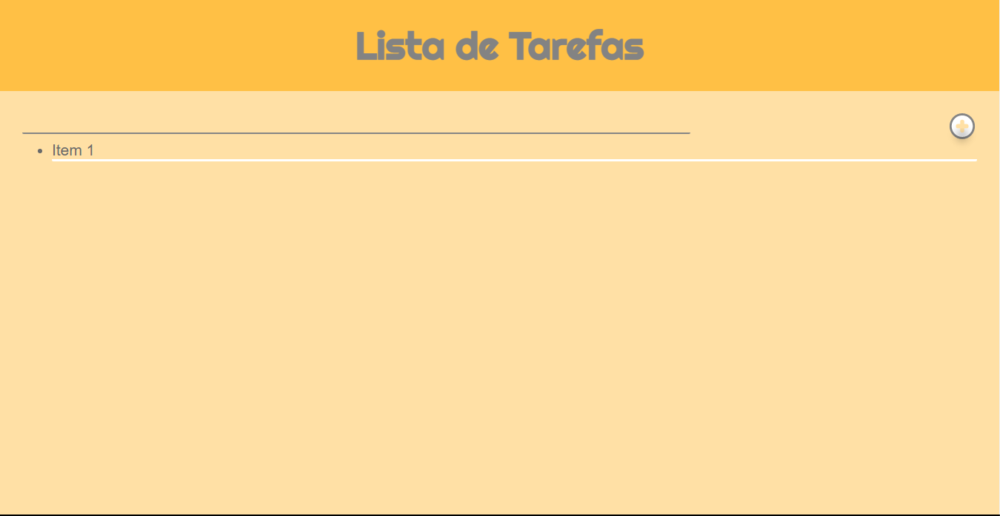

# Lista de tarefas

Projeto para treinar o uso do HTML, CSS e JS.

## Tela inicial

## Escrevendo o texto

## Hover sobre o botão que adiciona as tarefas

## Tarefa adicionada

## Ao não digitar nada

